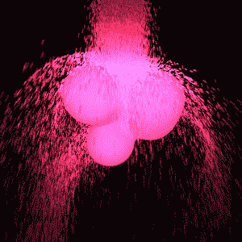

# Everyday One Motion - 20160414  

"Metaball vs. Particle"  

  

JavaScript, WebGL, Raymarching, GPGPU Particle  

[Everyday One Motion](http://motions.work/motion/191)  
[Demo Page](http://fms-cat-eom.github.io/20160414/dist)  

## 今月のテーマ

今月のテーマは「Particle」に変更となりそうです  

## Collision / Velocity of the scene

[前回](https://github.com/fms-cat-eom/20160407) のRaymarcherとパーティクルの当たり判定では、Raymarcherで描画した物体が動いていませんでした。これは、動いている物体とパーティクルとの当たり判定ができていなかったからです。  
今回、パーティクルがRaymarcherと衝突した際に、Distance Functionを時間で微分することにより、動くRaymarcherがどのくらいの速度でパーティクルに衝突してきたかがわかるようになりました。  

## Metaball

今回はメタボールとパーティクルをぶつけてみました。メタボールの描画は [eom_20160121](https://github.com/fms-cat-eom/20160121) でもやりました。  
パーティクルがメタボールと衝突して飛び散るのは非常に見ていて楽しいですね。  

## Volume of particle

ここまで、パーティクルの体積を計算することはしていません（同じ座標上に60000個のパーティクルが存在することができます！）  
これはいくらなんでもマズいので、何らかの手段でパーティクル同士をインタラクトさせる必要がありますね。どうすべきか…  
